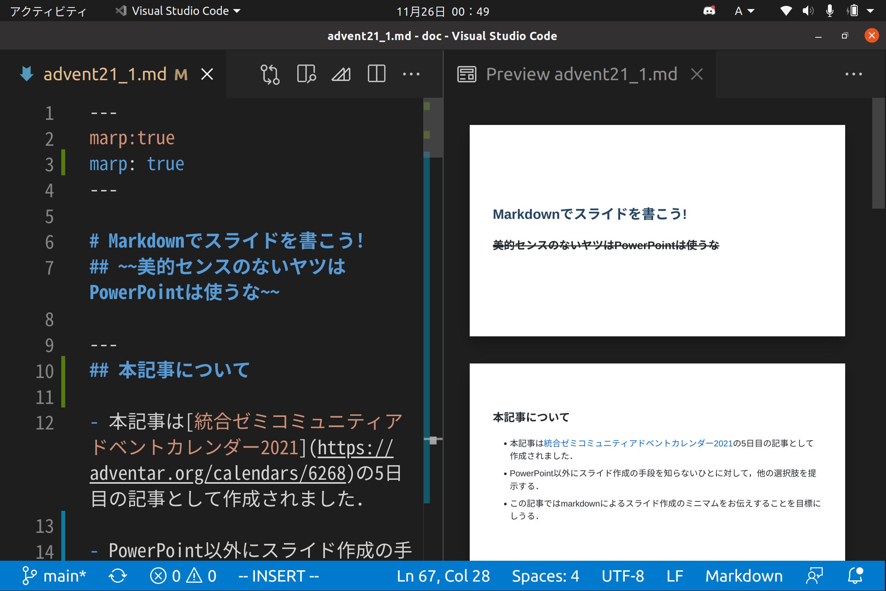

# Markdownでスライドを書こう!
~~美的センスのないヤツはPowerPointは使うな~~


---
## 本記事について
- 本記事は[統合ゼミコミュニティアドベントカレンダー2021](https://adventar.org/calendars/6268)の2日目の記事として作成されました．

- PowerPoint以外にスライド作成の手段を知らないひとに対して，他の選択肢を提示する．

- この記事では特にmarkdownによるスライド作成のミニマムをお伝えすることを目標にする．

- このスライドはmarkdownで書き，marpでexportしたもので，コードは[ここ](https://github.com/toshitnk/hp/blob/main/misc/doc/advent21_1.md?plain=1)から見ることができます．

- 質問，感想，もっといいスライドの書き方やツールの紹介などあれば[GitHub discussions](https://github.com/toshitnk/hp/discussions/5)や，統合のチャンネルなどに書き込んでください．喜びます．

---

## Power Pointの何がいけないのか
- 有料
- 閲覧に専用ソフトがいる
- 環境に依る
    - Windowsで編集したものをmacで見ると文字化けすることがある．そもそもLinux用のPower Pointはない．
    - pdfにexportすると，デザインが崩れることがある．
    - ~~たまに授業資料をpptxで送ってくる教員がいるが，お前だけはゆるさない．~~
- マウスでポチポチしなければいけないのが面倒．(私はマウスを持っていないので...．)
---

## Power Pointの何がいけないのか
- 文字の配置を手で決めるので，人のセンスに依る．
    - センスがない人が作ると絶望的．
    - 文字の配置や大きさがバラバラのスライドとか見たことがありませんか？
- 常にデザインに気を配る必要がある．(WYSIWYGの悪いところ．)
- 数式を打つのが面倒？(自分はpptで数式打ったことない...．)
- デフォルトの数式のフォントが汚い．

- いくらでも悪口言えそう...．
---
## 他のスライド作成ツール
- 自分の分野の都合上，数式を使うことが多いので，数式に関する問題は致命的．

- 私はよくLaTeXのbeamerをつかっている．

- ただし，いろいろパッケージを読み込んだり，環境構築が難しかったりと慣れるまで面倒な側面もある．

- もう少し，簡単に使えるツールを最近知ったので，紹介したい．


---

## スライドに必要なものとは？
- ここで，最低限スライドに必要なものを考えてみる．

    - ここまでのスライドをみてわかるように，箇条書きは必須．

    - タイトルや見出しをでかくしたい．

    - 多少の画像を表示させたい．

- こんなもの？

- このへんはmarkdownだと簡単にできます．

- アニメーションとか，動画とかいろいろなところに画像を表示させたいとかなど，凝ったことをしたい人は，markdownでは厳しいかも．
---
## Power Pointとの比較
- 無料
- 環境によらないテキストファイル
- デザインに悩む必要がない
    - 後述するコマンドがデザインを決める
    - センスがなくても大丈夫
    - 内容に集中できる
- 数式もTeX記法で打てて綺麗．e.g.,$\vec{F} = m\vec{a}$.
## beamerとの比較
- コードが簡単
- 環境構築も簡単
---
## Markdownでスライドを作るためのツール
- [marp](https://marp.app/)
    - 今回紹介するのはこれ．
    - markdownからpdf, html,(powerpoint)
- [HackMD](https://hackmd.io/#)
    - オンラインで使えるmarkdownエディタ．
    - 複数人での編集も可能．
- [pandoc](https://pandoc.org/)
    - marpよりちょっと高機能なやつ．
    - markdownからpdfだけでなく，TeXやword, powerpointなど，多様なファイルを変換できる．
    - その分，覚えることも多そうで諦めた．
---
## Markdownの記法
ここでは，スライドを作るための最低限の記法を紹介する．以下を見れば，このスライド程度のことはできる．
- 箇条書き
    ```
    - hogehoge
        - fuga
        - piyo
    ```
    とすれば箇条書きに階層もつけられる．
- Linkを貼る．
    `[コメント](URL)`でwebページへのリンクを埋め込める．
- 画像を貼る
    ``でできる．`[]`のなかに設定を書くと，大きさや配置も調整できる．
---
## Markdownの記法
- 見出し
    - `#`で一番大きい見出し．このスライドではタイトル．
    - `##`で少し小さい見出し．このスライドでは各ページの見出し．
    - と言ったように`#`の数を増やせば小さい階層の見出しにできる．

- ページ区切り
    - `---`で区切られた部分が一枚のスライドになる

---
## Markdownの記法
- 数式
    - `$c^2 = a^2 + b^2$`で
    インライン数式 $c^2 = a^2 + b^2$
    - `$$f(b) - f(a) = \int_{a}^{b}\frac{df(x)}{dx}dx$$`でディスプレイ数式
    $$f(b) - f(a) = \int_{a}^{b}\frac{df(x)}{dx}dx$$
    が書ける．
- コードブロック
    - ``` `Hello World!` ```とバッククオートで囲む．複数行ならバッククオート3つ．
---
## Markdown to pdf
- markdownのままではスライドにはならないので，pdfとして表示させたい．
- VScodeを使っている人は，marpの拡張機能を入れてmarpのツールバーからExport Slide Deckで出力できる．
    - viewするには一番最初に`marp: true`と入れる必要がある．
- CLIのmarpを入れた人はコマンドラインで`$ marp -o slide.pdf slide.md`でslide.mdをslide.pdfに出力できる．
- 最初に宣言すると，ヘッダーやフッターも設定できる．`paginate: true`でページ数を表示．頑張ればcssを書いて装飾もできる．

---

## VScodeでこのスライドを編集している様子



右にリアルタイムでviewが出るので便利．
~~一週間前から作成してて偉いですね~~

---
## まとめ
- 簡単なスライドを作るにはMarkdown + marpが便利！

1. marpをインストール
1. markdown記法をほんの少し覚える
1. marpでpdfに変換
で簡単にスライドが作れる

- スライドのデザインに悩んでいる人は，これを期にMarkdownを使ってみてはどうでしょう？
